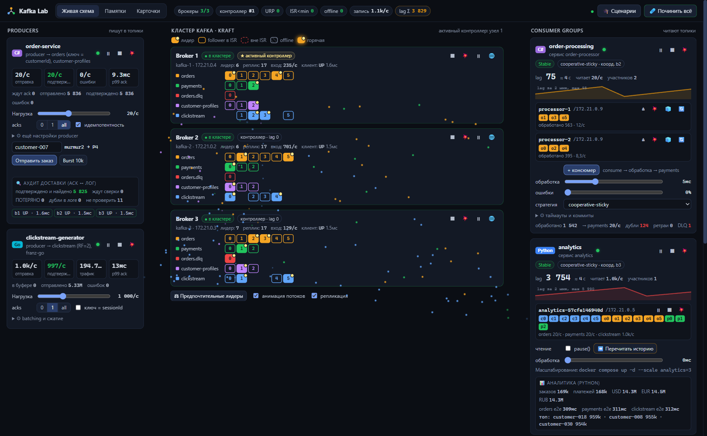

# Kafka Lab — визуальный учебный стенд Apache Kafka

Живая схема кластера Kafka, в которой видно, как сообщения текут от producer-ов к партициям и consumer group-ам, и в которую можно **ломать**: останавливать и «убивать» брокеры, замораживать процессы, добавлять задержки и потери пакетов, устраивать split brain, ронять и вешать консюмеров. Каждое изменение сразу видно на схеме и объяснено в журнале событий («почему?»).

**🌐 Онлайн-демо: https://dotpointt.github.io/kafka-lab/** — памятки, карточки и запись работы стенда (падение брокера, ребаланс, крэш консюмера, lag). Ломать кластер своими руками можно только в локальной версии — она поднимается одной командой (см. «Быстрый старт»).



## Что внутри

| Компонент | Язык | Что делает |
|---|---|---|
| **3 брокера Kafka 4.1** (KRaft, без ZooKeeper) | — | Каждый узел — брокер и контроллер; RF=3, min.insync.replicas=2 |
| **order-service** | C# (.NET 10, Confluent.Kafka) | Producer заказов (ключ = клиент) + профили в compacted-топик; «аудит доставки» ловит потери и дубли |
| **order-processor** | C# | Consumer group `order-processing`: N консюмеров на лету, крэш/зависание/рестарт, ретраи, DLQ, consume → produce |
| **analytics** | Python (confluent-kafka) | Вторая consumer group: pause/resume, перечитывание истории, масштабирование `--scale` |
| **clickstream-generator** | Go (franz-go) | Нагрузочный producer до 100k msg/s: batching, сжатие, acks, backpressure |
| **control-center** | C# (ASP.NET, AdminClient, Docker API) | Мониторинг кластера, имитация сбоев, веб-интерфейс |

В интерфейсе:
- **Живая схема** — producers → брокеры с партициями (лидеры, ISR, offline) → consumer groups с участниками и lag; анимация потоков сообщений и репликации.
- **Сбои** — у каждого брокера: Stop (graceful), Kill (SIGKILL), Pause, Сеть (задержка, потери, полная изоляция, split brain). У сервисов — stop/kill/pause, у консюмеров — крэш, зависание, рестарт.
- **Нагрузка** — ползунки скорости, acks, идемпотентность, linger, сжатие, горячий ключ, время обработки, процент ошибок, стратегия ребаланса, KIP-848, static membership.
- **🎓 Сценарии** — 15 пошаговых лабораторных: ключи и партиции, ребаланс, lag, падение брокера, min.insync.replicas, потеря данных при acks=1 («зомби-лидер»), дубли при ретраях, KRaft, DLQ, compaction…
- **Журнал событий** — «Выборы лидера: orders-3 (1→2)», «ISR сократился», «Группа: Stable → PreparingRebalance»… у каждого события кнопка «почему?».
- **Партиции и offset-ы, Графики, Сообщения** — таблица lag по партициям, графики за 5 минут, чтение последних сообщений и отправка своих (poison pill, tombstone).
- **Памятки** — 10 конспектов (основы, producer, consumer, репликация и KRaft, хранение, гарантии, эксплуатация и CLI, шпаргалка, Kafka vs RabbitMQ, устройство стенда).
- **Карточки** — 60+ вопросов с интервальным повторением (система Лейтнера), прогресс сохраняется в браузере.

## Быстрый старт

Нужен Docker Desktop (≈ 4 GB свободной памяти для контейнеров).

```bash
docker compose up -d --build
```

Через 1–2 минуты откройте **http://localhost:8080**.

| Адрес | Что |
|---|---|
| http://localhost:8080 | Kafka Lab (визуализация, сценарии, памятки) |
| localhost:19092, 19093, 19094 | Брокеры для клиентов с хоста (IDE, kcat) |
| http://localhost:8081 / 8082 / 8084 | HTTP API order-service / order-processor / clickstream-generator |
| http://localhost:8090 | kafka-ui (только с `docker compose --profile ui up -d`) |

Остановить: `docker compose down` (данные сохранятся) или `docker compose down -v` (стереть всё).

Пересобрать один сервис после правок, не трогая брокеры: `docker compose up -d --build --no-deps order-service`
(общий `docker compose up -d --build` пересоздаёт и брокеры — данные останутся на томах, но кластер на минуту перезапустится).

## С чего начать

1. Откройте **Памятки → «Kafka за 10 минут»** (5 минут чтения).
2. Вернитесь на **Живую схему**, наведите мышь на чипы партиций, участников групп и метрики — везде есть подсказки.
3. Нажмите **🎓 Сценарии** и пройдите по порядку: сначала «база», потом «сбои», потом «гарантии».
4. Закрепляйте во вкладке **Карточки** (клавиши: пробел — перевернуть, 1/2/3 — оценка).

## Онлайн-версия (GitHub Pages)

Workflow [`.github/workflows/pages.yml`](.github/workflows/pages.yml) публикует статическую копию UI. На Pages нет бэкенда (Kafka, Docker, control-center), поэтому:

- «Памятки» и «Карточки» работают полностью;
- «Живая схема» проигрывает **запись реального стенда** — настоящие снимки кластера раз в секунду и настоящий журнал событий ([`demo/recording.json`](demo/recording.json)), с паузой, перемоткой и пояснениями к каждому моменту;
- кнопки сбоев и настройки в онлайн-версии показывают подсказку о локальном запуске.

Перезаписать демо на своём стенде: `python tools/record-demo.py` (около 4 минут), затем закоммитить `demo/recording.json`.

## Структура репозитория

```text
docker-compose.yml           кластер + сервисы
infra/kafka/                 образ брокера (+ iproute2 для tc) и скрипт создания топиков
services/order-service/      C# producer
services/order-processor/    C# consumer group
services/analytics/          Python consumer group
services/clickstream-generator/  Go producer
services/control-center/     C# мониторинг + сбои + UI (wwwroot)
docs/                        памятки (Markdown, показываются во вкладке «Памятки»)
demo/recording.json          запись стенда для онлайн-демо
tools/record-demo.py         скрипт записи демо
.github/workflows/pages.yml  публикация на GitHub Pages
```

Подробности об устройстве — в [docs/10-about-lab.md](docs/10-about-lab.md).
